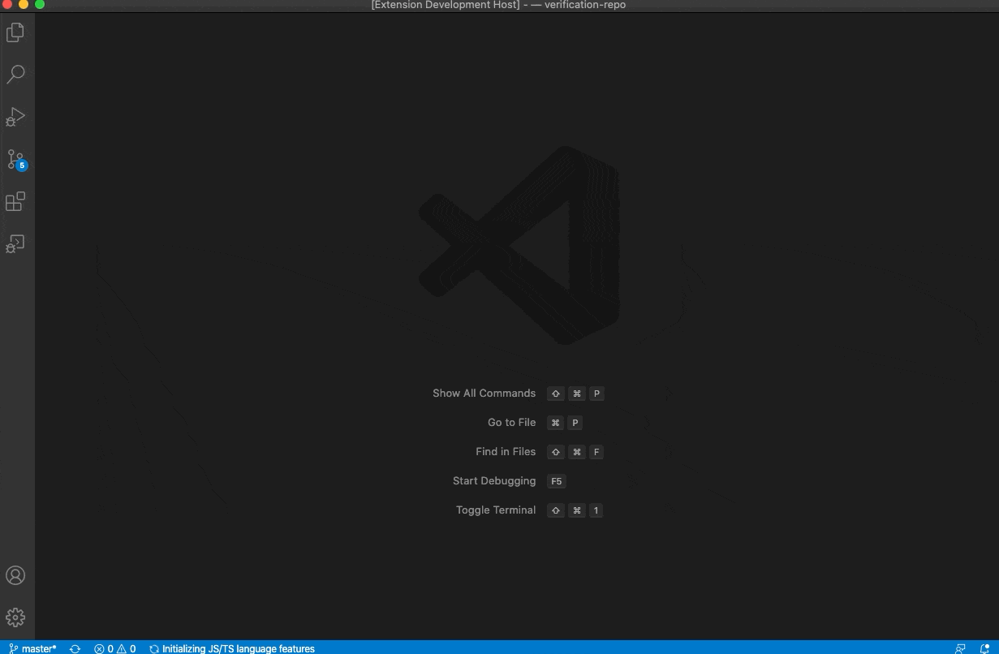
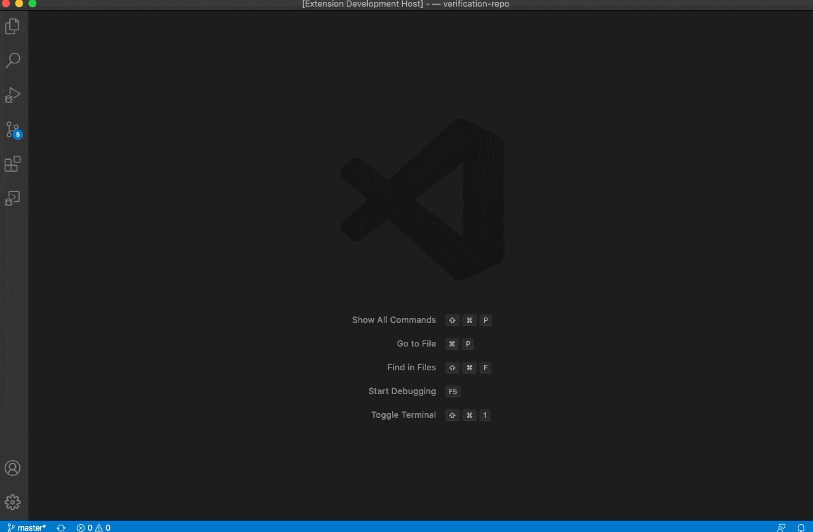

# Search everywhere

The extension is inspired by JetBrains IDEs feature "Search Everywhere".
It allows user to easily navigate through files and symbols in the whole workspace.

It is the alternative for "Go to Symbol in Workspace..." - fully customizable.

<br/>
Brand new version - rewritten from scratch to be more flexible and smoother.

## How it works

After initialization the extension indexes the whole workspace. It scans both files and all symbols for each file according to set up patterns in settings.

After that, it listens for any change in the workplace, e.g.

* add, rename, delete function, variable or anything other in file
* add, rename, delete, move a file between directories or even between projects in the opened workspace

The above guarantees that the data is always up to date.

<br/>
Worth mentioning is the optimization of scanning algorithm. It queues every change and reduces not necessary actions to assure the scan is smooth and very quick.

<br/>
<br/>


## Features

Init on startup or first call

Notification placeholder

toast
    <br/>

    <br/>

status bar
    <br/>

    <br/>
    <br/>

Debounce of search results while filtering

enabled
    <br/>

    <br/>

disabled
    <br/>

    <br/>

Highlight of selected symbol

enabled
    <br/>

    <br/>

disabled
    <br/>

    <br/>

Customizable icon for each item type

Customizable filter phrase for each item type

  <br/>

Customizable items filter to reduce items set

Customizable help phrase

Customizable exclude patterns

Customizable include pattern

Ability to decide whether use extension exclude patterns or "Files: Exclude" and "Search: Exclude" patterns

## Commands

* `searchEverywhere.search`

  Search any symbol/file in the currently opened workspace.

  Default keybinding for the command is:
  * mac: `alt + cmd + p`
  * win/linux: `ctrl + alt + p`

* `searchEverywhere.reload`

  Re-index the whole workspace.

## Extension Settings

* `searchEverywhere.shouldInitOnStartup`

Should indexing be initialized on Visual Studio Code startup.
Default value: `false`.

* `searchEverywhere.shouldDisplayNotificationInStatusBar`

Should display indexing notification in toast or status bar.
Default value: `false`.

* `searchEverywhere.shouldHighlightSymbol`

Should the selected symbol be highlighted.
Default value: `false`.

* `searchEverywhere.shouldUseDebounce`

Should the debounce function be used while returning filter results (useful in case of the large workspace).
Default value: `true`.

* `searchEverywhere.icons`

Ability to define icons that should be displayed for appropriate item types. According to VSC API, only Octicons are allowed. Not defined item type will not have any icon.

Default value:

```
{
  "0": "file-code",
  "1": "file-submodule",
  "2": "archive",
  "3": "package",
  "4": "checklist",
  "5": "list-unordered",
  "6": "tag",
  "7": "location",
  "8": "plus-circle",
  "9": "list-ordered",
  "10": "milestone",
  "11": "zap",
  "12": "beaker",
  "13": "shield-lock",
  "14": "typography",
  "15": "file-binary",
  "16": "file-diff",
  "17": "server",
  "18": "code",
  "19": "key",
  "20": "dot",
  "21": "kebab-horizontal",
  "22": "filter",
  "23": "fire",
  "24": "cpu",
  "25": "north-star"
}
```

* `searchEverywhere.itemsFilter`

Ability to define a filter that should be applied to items.
All kinds can be find here: https://code.visualstudio.com/api/references/vscode-api#SymbolKind

Default value:

```
{
  "allowedKinds": [],
  "ignoredKinds": [],
  "ignoredNames": []
}
```

Below is an example which will remove from items all arrays (17), booleans (16) and the ones containing "foo" string in the name:

```
{
  "allowedKinds": [],
  "ignoredKinds": [16, 17],
  "ignoredNames": ["foo"]
}
```

* `searchEverywhere.shouldUseItemsFilterPhrases`

Should be a possibility to filter by assigned filter phrases.
Default value: `true`.


* `searchEverywhere.itemsFilterPhrases`

Phrases for item type which could be used for narrowing the results down.

Default value:

```
{
  "0": "$$",
  "4": "@@",
  "11": "!!",
  "14": "##",
  "17": "%%"
}
```

* `searchEverywhere.helpPhrase`

A phrase which should invoke help.
Default value: `?`

* `searchEverywhere.exclude`

An array of globs. Any file matching these globs will be excluded from indexing.

Default value:

```
[
  "**/.git",
  "**/.svn",
  "**/.hg",
  "**/.CVS",
  "**/.DS_Store",
  "**/package-lock.json",
  "**/yarn.lock",
  "**/node_modules/**",
  "**/bower_components/**",
  "**/coverage/**",
  "**/.vscode/**",
  "**/.vscode-test/**",
  "**/.history/**",
  "**/.cache/**",
  "**/.cache-loader/**",
  "**/out/**",
  "**/dist/**"
]
```

* `searchEverywhere.include`

String with include pattern. Any file matching this glob will be included in indexing.

Default value:

```
"**/*.{js,jsx,ts,tsx}"
```

* `searchEverywhere.excludeMode`

Ability to choose which exclude option should be applied. If gitignore file is not found or is empty, extension setting is used as a fallback. Available options: `search everywhere`, `files and search`, `gitignore`.
Default value: `search everywhere`.

## Release Notes

Please check changelog for release details.

## How to run it locally

If you would like to run the extension locally, go through the following steps:

  1. clone the repository
  2. run `npm install` to install all dependencies
  3. open `run and debug` view
  4. run `run extension`
  5. enjoy development!

## Author

[Kamil Bysiec](https://github.com/kbysiec)

## Acknowledgment

If you found it useful somehow, I would be grateful if you could leave a "Rating & Review" in Marketplace or/and leave a star in the project's GitHub repository.

Thank you.
