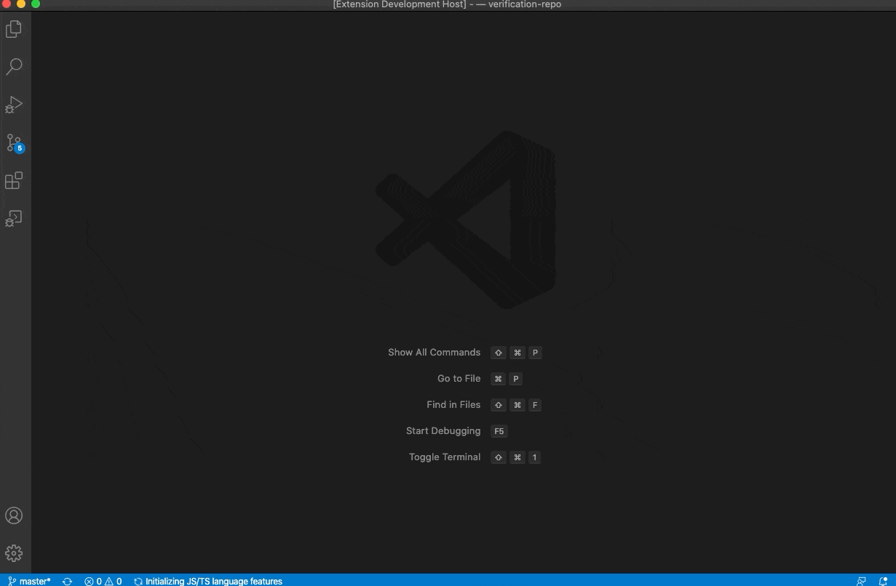
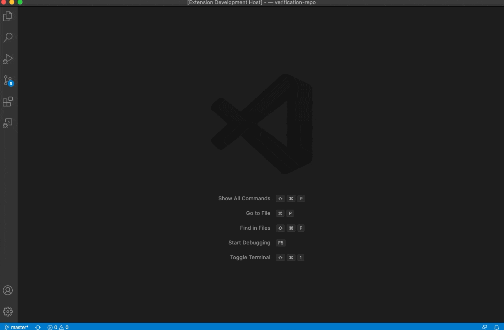

# Search everywhere

The extension is inspired by JetBrains IDEs feature "Search Everywhere".
It allows user to easily navigate through files and symbols in the whole workspace.

It is the alternative for "Go to Symbol in Workspace..." - fully customizable.


> 🚀 **v3.0.0 Released: The Next-Gen SQLite WASM Engine**
> 
> Engineered for speed and massive enterprise codebases:
> - ⚡ **Sub-millisecond query latency (~0.20 ms)** powered by covering B-Tree indexes (and **0.00 ms** instant LRU cache).
> - 🐘 **Massive scale:** Effortlessly indexes and searches workspaces with **over 2,000,000 symbols**.
> - 🪶 **95% RAM reduction:** Peak memory slashed from **> 1.5 GB down to < 80 MB** thanks to streaming batch indexing.
> - 🔄 **Zero-lag real-time tracking:** Changes to variables, functions, and components are synchronized instantly without freezing your editor.
> - 🗂️ **Multi-root workspaces:** Seamless cross-project search with dynamic folder resolution.

## How it works

The extension indexes the whole workspace using an embedded **SQLite WebAssembly** database. It scans both files and all symbols for each file according to configured patterns. The scan can be initialized automatically on startup of Visual Studio Code or postponed until the first launch.

After the scan is completed, the extension continuously tracks changes in the workspace:
* add, rename, or delete functions, classes, variables, or React components
* add, rename, delete, or move files across directories or different projects in a multi-root workspace

### Next-Gen Performance Highlights (v3.0)

| Metric | Before (v2.x In-Memory) | Now (v3.0 SQLite WASM) | Improvement |
| :--- | :---: | :---: | :---: |
| **Search Response Time** | ~8.8 ms | **~0.20 ms** (0.00 ms cached) | **44x faster** |
| **Peak RAM Usage (2M symbols)** | > 1,500 MB (1.5 GB) | **< 80 MB** | **95% less RAM** |
| **Workspace Scalability** | Crashes / freezes on large repos | **2,000,000+ symbols** | **Enterprise-grade** |
| **Live Typing Lag** | Noticeable editor stutter | **Zero stutter** (300 ms debounce) | **Smooth typing** |


## Features

* Init on startup or first call

* Notification placeholder

  toast

  

  status bar

  


* Debounce of search results while filtering

  enabled

  


  disabled

  


* Highlight of selected symbol

  enabled

  


  disabled

  

* Customizable icon for each item type

* Customizable filter phrase for each item type

  

* Customizable items filter to reduce items set

* Customizable help phrase

* Customizable exclude patterns

* Customizable include pattern

* Ability to decide whether use extension exclude patterns or "Files: Exclude" and "Search: Exclude" patterns

* Item icon to open it to the side

* Drill-down search in a specific file: search symbols inside any file by clicking the right-arrow icon button or using a shortcut (`alt + right`). Return to workspace search anytime with `alt + left` or the Back button.

* Dedicated output with logs related to triggered actions, scanned directories structure, etc.

* Ability to decide whether the items should be sorted by type

* Ability to cache the scanned workspaceData to as a result scan the workspace only once

* Shared cache across git worktrees and local clones of the same repository

* Recent items and currently open editor files displayed when search query is empty

## Commands

* `searchEverywhere.search`

  Search any symbol/file in the currently opened workspace.

  Default keybinding for the command is:
  * mac: `alt + cmd + p`
  * win/linux: `ctrl + alt + p`

* `searchEverywhere.searchCurrentFile`

  Search symbols within the currently active editor file (scoped file search / outline).

  Default keybinding:
  * mac: `alt + cmd + o`
  * win/linux: `ctrl + alt + o`

* `searchEverywhere.navigateIntoFile`

  Drill down into the selected file item to search symbols within it while inside Search Everywhere. Also available via the right-arrow button on file items.

  Default keybinding: `alt + right` (mac/win/linux, configurable)

* `searchEverywhere.navigateBack`

  Navigate back to the workspace search from a file search, preserving your previous query. Also available via the Back button on the title bar.

  Default keybinding: `alt + left` (mac/win/linux, configurable)

* `searchEverywhere.reload`

  Re-index the whole workspace.

* `searchEverywhere.clearSharedCache`

  Clear the shared repository cache used across git worktrees and clones.

## Extension Settings

* `searchEverywhere.shouldInitOnStartup`

Should indexing be initialized on Visual Studio Code startup.
Default value: `false`.

* `searchEverywhere.shouldDisplayNotificationInStatusBar`

Should display indexing notification in toast or status bar.
Default value: `false`.

* `searchEverywhere.shouldHighlightSymbol`

Should the selected symbol be highlighted.
Default value: `false`.

* `searchEverywhere.shouldUseDebounce`

Should the debounce function be used while returning filter results (useful in case of the large workspace).
Default value: `true`.

* `searchEverywhere.icons`

Ability to define icons that should be displayed for appropriate item types. According to VSC API, only Octicons are allowed. Not defined item type will not have any icon.

Default value:
```json
{
  "0": "symbol-file",
  "1": "file-submodule",
  "2": "symbol-namespace",
  "3": "package",
  "4": "symbol-class",
  "5": "symbol-method",
  "6": "symbol-property",
  "7": "symbol-field",
  "8": "symbol-ruler",
  "9": "symbol-enum",
  "10": "symbol-interface",
  "11": "variable-group",
  "12": "symbol-variable",
  "13": "symbol-constant",
  "14": "symbol-string",
  "15": "symbol-numeric",
  "16": "symbol-boolean",
  "17": "symbol-array",
  "18": "symbol-keyword",
  "19": "symbol-key",
  "20": "remove",
  "21": "symbol-enum-member",
  "22": "symbol-structure",
  "23": "symbol-event",
  "24": "symbol-operator",
  "25": "type-hierarchy-sub"
}
```

Below you can find the table with information which symbol kind refers to which symbol name:

| kind | icon               | symbol name    |
|------|:------------------:|:--------------:|
|   0  | symbol-file        | file           |
|   1  | file-submodule     | module         |
|   2  | symbol-namespace   | namespace      |
|   3  | package            | package        |
|   4  | symbol-class       | class          |
|   5  | symbol-method      | method         |
|   6  | symbol-property    | property       |
|   7  | symbol-field       | field          |
|   8  | symbol-ruler       | constructor    |
|   9  | symbol-enum        | enum           |
|  10  | symbol-interface   | interface      |
|  11  | variable-group     | function       |
|  12  | symbol-variable    | variable       |
|  13  | symbol-constant    | constant       |
|  14  | symbol-string      | string         |
|  15  | symbol-numeric     | number         |
|  16  | symbol-boolean     | boolean        |
|  17  | symbol-array       | array          |
|  18  | symbol-keyword     | object         |
|  19  | symbol-key         | key            |
|  20  | remove             | null           |
|  21  | symbol-enum-member | enum member    |
|  22  | symbol-structure   | struct         |
|  23  | symbol-event       | event          |
|  24  | symbol-operator    | operator       |
|  25  | type-hierarchy-sub | type parameter |

* `searchEverywhere.itemsFilter`

Ability to define a filter that should be applied to items.
All kinds can be find here: https://code.visualstudio.com/api/references/vscode-api#SymbolKind

Default value:

```json
{
  "allowedKinds": [],
  "ignoredKinds": [],
  "ignoredNames": []
}
```

Below is an example which will remove from items all arrays (17), booleans (16) and the ones containing "foo" string in the name:

```json
{
  "allowedKinds": [],
  "ignoredKinds": [16, 17],
  "ignoredNames": ["foo"]
}
```

* `searchEverywhere.shouldUseItemsFilterPhrases`

Should be a possibility to filter by assigned filter phrases.
Default value: `true`.


* `searchEverywhere.itemsFilterPhrases`

Phrases for item type which could be used for narrowing the results down.

Default value:

```json
{
  "0": "$$",
  "4": "@@",
  "11": "!!",
  "14": "##",
  "17": "%%"
}
```

* `searchEverywhere.helpPhrase`

A phrase which should invoke help.
Default value: `?`

* `searchEverywhere.shouldItemsBeSorted`

Ability to decide whether items should be sorted by type.
Default value: `true`

* `searchEverywhere.exclude`

An array of globs. Any file matching these globs will be excluded from indexing.

Default value:

```json
[
  "**/.git",
  "**/.svn",
  "**/.hg",
  "**/.CVS",
  "**/.DS_Store",
  "**/package-lock.json",
  "**/yarn.lock",
  "**/node_modules/**",
  "**/bower_components/**",
  "**/coverage/**",
  "**/.vscode/**",
  "**/.vscode-test/**",
  "**/.history/**",
  "**/.cache/**",
  "**/.cache-loader/**",
  "**/out/**",
  "**/dist/**"
]
```

* `searchEverywhere.include`

String with include pattern. Any file matching this glob will be included in indexing.

Default value:

```json
"**/*.{js,jsx,ts,tsx}"
```

* `searchEverywhere.excludeMode`

Ability to choose which exclude option should be applied. If gitignore file is not found or is empty, the extension option is used as a fallback. Available options: `search everywhere`, `files and search`, `gitignore`. To see the changes from the updated gitignore file after indexing, the reload must be done.
Default value: `search everywhere`.

* `searchEverywhere.shouldWorkspaceDataBeCached`

Ability to decide if the workspace should be indexed only once. Each next startup of Visual Studio Code will collect data from cache.
Default value: `true`

* `searchEverywhere.shouldSearchSelection`

Ability to decide whether selection in the active editor is put in the search.
Default value: `true`

* `searchEverywhere.excludeProperties`

Ability to exclude object properties (symbol kind 6) from indexing to drastically reduce memory usage and speed up search in large projects.
Default value: `true`

* `searchEverywhere.excludeVariables`

Ability to exclude variables and constants (symbol kind 12) from indexing. Keeping this `false` ensures variables and React functional components remain searchable.
Default value: `false`

* `searchEverywhere.shareCacheAcrossWorktrees`

Ability to share the indexed database cache across git worktrees and local clones of the same repository.
Default value: `true`

* `searchEverywhere.showRecentItemsOnEmpty`

Ability to show recently visited items and active editor tabs when the search query is empty.
Default value: `true`

* `searchEverywhere.recentItemsLimit`

Maximum number of recent items to show when the search query is empty.
Default value: `10`

## Release Notes

Please check changelog for release details.

## How to run it locally

If you would like to run the extension locally, go through the following steps:

  1. clone the repository
  2. run `npm install` to install all dependencies
  3. open `run and debug` view
  4. run `run extension`
  5. enjoy development!

## Author

[Kamil Bysiec](https://github.com/kbysiec)

## Acknowledgment

If you found it useful somehow, I would be grateful if you could leave a "Rating & Review" in Marketplace or/and leave a star in the project's GitHub repository.

Thank you.
