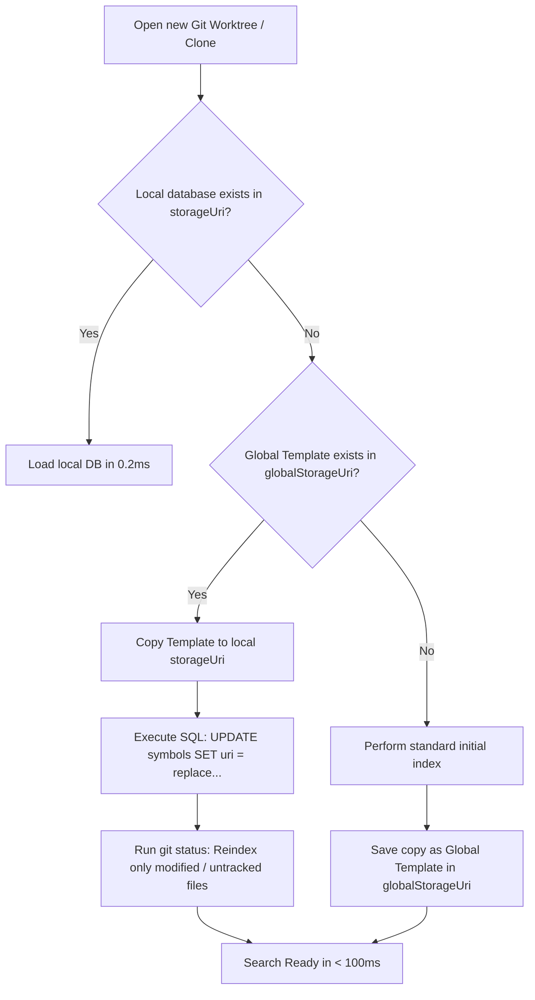

# Architectural Design: Shared Repository Cache Across Clones & Worktrees (Method A)

> **Reference Issue**: [GitHub Issue #54 — Link cache between different copies of the same repo](https://github.com/kbysiec/vscode-search-everywhere/issues/54)  
> **Status**: Accepted / Implementation  
> **Target Version**: 3.1.0  
> **Author**: Kamil Bysiec & Pair Programming Assistant

---

## 1. Context & Problem Statement

In modern software development workflows (such as Git worktrees, feature-branch isolation, CI environments, or company-mandated workflows), developers frequently clone the same repository into separate directories (e.g. `/work/repo-bugfix-123`, `/work/repo-feat-456`) or use `git worktree add`.

In VS Code, each unique workspace folder receives an isolated `context.storageUri` based on the hash of its absolute file path. Consequently:
- Every new worktree or clone is treated as an entirely new project.
- The extension runs a full workspace indexing from scratch (parsing ASTs of tens of thousands of files).
- In large enterprise repositories (50,000+ files, 1M–2M symbols), this results in noticeable startup delays (30–90 seconds) on every new checkout.

### User Request (Issue #54)
> *"The flow that my job uses requires cloning of the same repo over and over again for each new bug/feature/whatever, leading to long index times at startup. It would be nice if there was a way to link the cache between different copies of the same repo and have the changes handled by differences in the git working tree/untracked files."*

---

## 2. Alternatives Considered

### Alternative 1: Direct Real-Time Database Sharing (Rejected)
*Concept*: Pointing all worktrees of the same repository directly to a single shared `.db` file in real time.
*Why Rejected*:
- **Path collisions**: `symbols.uri` stores absolute paths. Worktree A (`/dir-a/file.ts`) and Worktree B (`/dir-b/file.ts`) would overwrite or duplicate records.
- **Dirty buffer pollution**: In-memory unsaved documents in one VS Code window would corrupt search results in another window.
- **SQLite Concurrency Locks**: Concurrent read/write transactions across multiple VS Code Extension Host processes cause locking contention and `busy` errors.

### Alternative 2: SQLite `ATTACH DATABASE` with Delta Overlay (Rejected)
*Concept*: Mounting a read-only master database and maintaining a local in-memory table of overrides.
*Why Rejected*:
- **Virtual FS complexity**: `sql.js` (WebAssembly) runs in memory with simulated Emscripten filesystems; dynamic cross-database attachment in Node.js extension hosts is fragile.
- **Query degradation**: To merge the base DB with local overrides, every query requires a complex `UNION ALL` or subquery filtering out overridden URIs (`WHERE uri NOT IN (SELECT uri FROM overrides)`). This destroys covering B-Tree index lookup speed, degrading 0.20 ms search times to tens of milliseconds.

---

## 3. Adopted Solution: Method A — Seed-and-Adapt Isolated Architecture

### Overview
Method A implements a **Template Seeding with Instant Path Adaptation** strategy:
1. **Global Repository Template**: A master database snapshot is stored in `context.globalStorageUri` per repository fingerprint.
2. **Instant Local Seeding**: When a new worktree or clone is opened for the first time without a local database, it copies the global template into its local `context.storageUri` (~5–10 ms).
3. **High-Speed Path Adaptation**: A single SQLite statement updates all absolute URIs from the template root to the current worktree root (~5 ms):
   ```sql
   UPDATE symbols SET uri = replace(uri, :templateRootUri, :currentRootUri);
   ```
4. **Git Delta Refresh**: Rather than scanning 50,000 files, the extension inspects `git status --porcelain` to identify only modified, added, or untracked files in the current worktree, and reindexes *only* that small delta (~50 ms).
5. **Full Isolation**: Each worktree operates on its own dedicated SQLite instance with zero cross-process locking and zero risk of dirty document leakage.



---

## 4. Technical Specifications

### 4.1. Repository Fingerprinting
To uniquely identify that two distinct directories belong to the same project, we compute a SHA-256 hash from:
1. Primary: Git remote URL (`git config --get remote.origin.url`).
2. Fallback (local repos without remote): Initial commit hash (`git rev-list --max-parents=0 HEAD`).
3. Filename format: `repo-<hash>.db` and metadata `repo-<hash>.json`.

### 4.2. Template Metadata (`repo-<hash>.json`)
```json
{
  "fingerprint": "a3f5b7...",
  "originUrl": "git@github.com:myorg/repo.git",
  "templateRootUri": "file:///Users/dev/work/repo-main",
  "symbolCount": 185420,
  "lastUpdated": 1728139200000
}
```

### 4.3. RAM & Resource Footprint
To ensure opening multiple worktrees does not exhaust system memory while keeping the entire B-Tree hot in cache even for massive mono-repositories:
- SQLite page cache is dynamically bounded per window:
  ```sql
  PRAGMA cache_size = -64000; -- Up to 64 MB dynamic memory ceiling
  ```
- **Dynamic Allocation ("Pay-as-you-grow")**: Small projects use only **~2–5 MB RAM**, medium projects use **~15 MB**, while large enterprise workspaces (1,000,000+ symbols) are comfortably cached in **~40–60 MB RAM** with zero page thrashing.

### 4.4. Lifecycle & Cleanup
- **Worktree removal**: When a worktree is deleted (`git worktree remove` or directory deletion), VS Code's built-in `StorageService` automatically garbage-collects orphaned `workspaceStorage` directories.
- **Global template retention**: The global storage maintains only 1 template per repository fingerprint (overwritten on clean index/exit).
- **Manual control**: A command `searchEverywhere.clearSharedCache` enables users to purge all shared templates on demand.

### 4.5. Configuration Setting
- `searchEverywhere.shareCacheAcrossWorktrees`: `boolean` (default: `true`).

---

## 5. Summary of Benefits
- 🚀 **Startup Time**: Reduced from **~60 seconds** to **< 100 milliseconds** for new worktrees.
- 🔒 **Zero Locking / Race Conditions**: Complete process and file isolation.
- 📝 **Dirty Buffer Safety**: Unsaved in-memory edits remain strictly isolated to the active editor window.
- 🪶 **Controlled Memory Footprint**: Dynamically scaled with a hard ceiling at **~64 MB RAM** per worktree window.
